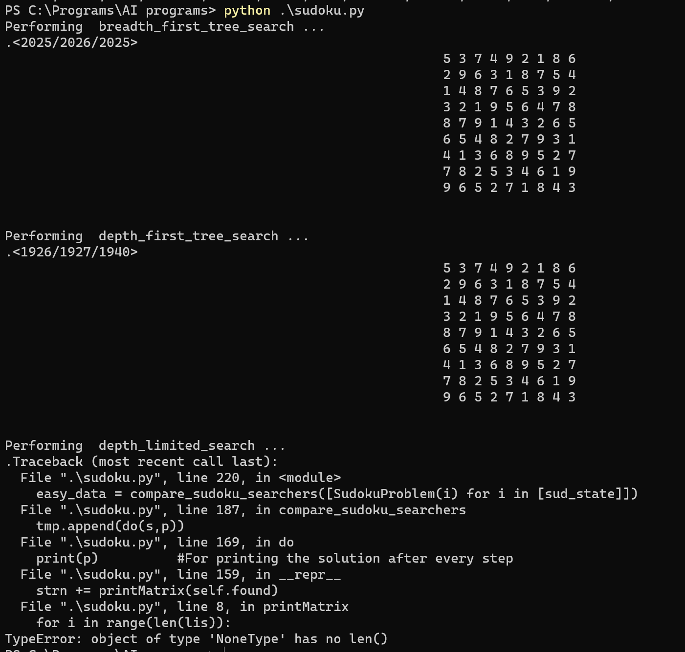
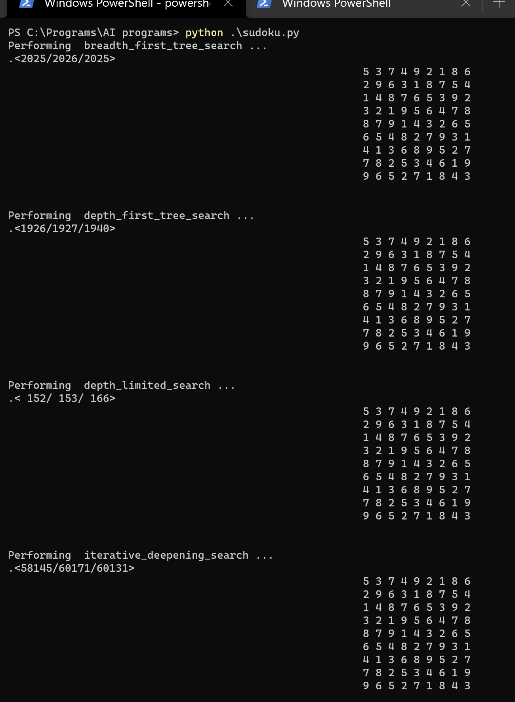

# Sudoku_Solver
Modification of the aima-python/search.py to solve sudoku and analyse different algorithms
## Formulation of the Sudoku problem.

1.	Initial State :– 
A list of numbers representing the sudoku matrix. It contains numbers from 0 to 9, with zero representing the blank or unfilled cells. The numbers are filled based on the Sudoku Rule*.

2.	Goal Test:-
If a state contains no blank or unfilled cells and the state follows the Sudoku Rule then it is a goal state.

3.	Actions:-
To select from a list of values that is a subset of [1..9] so that it does not violate the Sudoku Rule.
Steps:-
- 1.	Find the nearest unfilled cell.
  2.	Make a list of possible values that can be filled.

4.	Result
We will select one of the actions and fill the blank cell with it. This would be our next state in the search space.

5.	Path Cost
We do not require a path cost as our sole goal is to find out the goal state.
So it could be unit cost for every move.

#### *Note: 
Sudoku Rule – That every row, column and a 3x3 sub-matrix (only the outer most) should have only one occurrence of a number from the set [1..9].

## Formulation of the problem in Python.

The python program is attached in this current folder as [sudoku.py](./sudoku.py).

## Creation of Instances (Difficulty = [Easy, Medium, Hard])
To generate instances I have used createInstances.py which takes the values in the sudoku.csv file and pre-processes it to satisfy input state format. It also classifies the inputs based on their difficulty and assigns the lists into three categories:-
-	Easy
-	Medium
-	Hard

## Solving the instances using the basic search strategies.
-	Breadth-First Search
-	Depth-First Search
-	Depth-Limited Search
-	Iterative Deepening Search

**Question- Is it possible to fix a reasonable limit a priori for Depth Limited Search?** 
For a given Sudoku matrix we can predict the limit for DLS by counting the total number of unfilled cells in our initial state. As seen in this example below  

Fig 1. The depth limited search yields an error when the depth limit is 52

 
Fig 2. The depth limited search yields an error when the depth limit is 53

## Performing Empirical Analysis
After solving all the instances(easy, medium, hard) I have performed an analysis which gives us the statistics of how many number of successor nodes, number of goal tests, number of states that are generated for a problem in the dataset.

### Easy Matrices
|   Searcher          |	Successor States | Goal Tests	| States Traversed	| Time Taken |
| :-----------------: | :--------------: | :--------: | :--------------: | :--------: |
|  Breadth-First      |	     119753      |	   119754  |	      119753     |	   8.0980  |
| 	Depth-First        |       25171      |     25172  |        25188     |	   1.6906  |
| 	Depth-Limited      |       85069      |     85070 	|        85083    	|    5.8156  |
| Iterative Deepening	|     3546192	     |   3665946 	|      3665905    	|   34.855   |

### Medium Matrices
|   Searcher          |	Successor States | Goal Tests	| States Traversed	| Time Taken |
| :-----------------: | :--------------: | :--------: | :--------------: | :--------: |
|  Breadth-First      |	     143923      |	   143924  |	      143923     |	  10.0229  |
| 	Depth-First        |       34741      |     34742  |        34758     |	   2.5125  |
| 	Depth-Limited      |      118807      |    118808 	|       118822    	|    7.9047  |
| Iterative Deepening	|     3951956	     |   3951957 	|      3951994    	|  534.5674  |

### Hard Matrices

|   Searcher          |	Successor States | Goal Tests	| States Traversed	| Time Taken |
| :-----------------: | :--------------: | :--------: | :--------------: | :--------: |
|  Breadth-First      |	     441027      |	   441028  |	      441027     |	  30.7734  |
| 	Depth-First        |       92106      |     92107  |        92122     |	   6.4562  |
| 	Depth-Limited      |      348978      |    348979 	|       348994    	|   24.8718  |
| Iterative Deepening	|    13051713	     |  13492742 	|     13492701    	|  859.0561  |

#### NOTE:
IDS for Medium and Hard Matrices took too long to process, so the results are from a dataset of length 10. The rest of the searches are implemented for datasets  of length 34.

## Ideas for going beyond basic search strategies.
In my opinion, what we can do for optimising this sudoku problem is that, we can prioritize the cells of a state and fill the cell with the highest priority. With the priority going to the cell with the least number of possible values.

